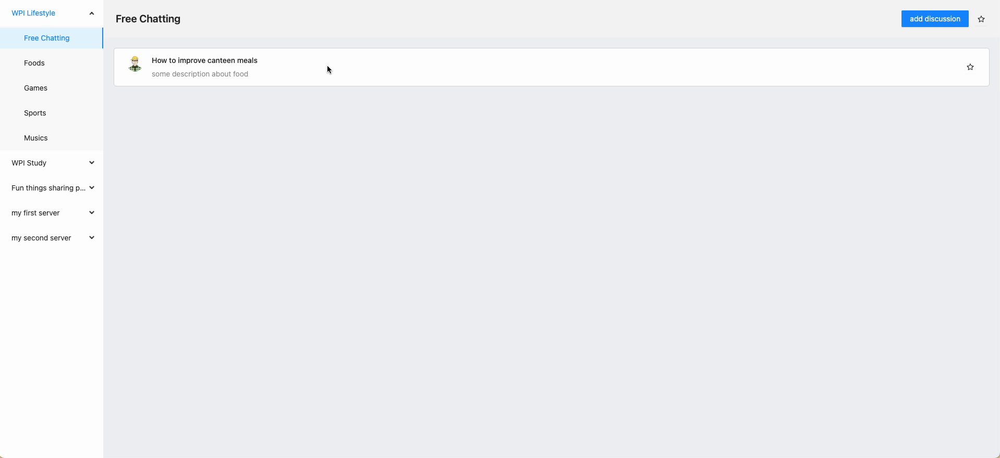
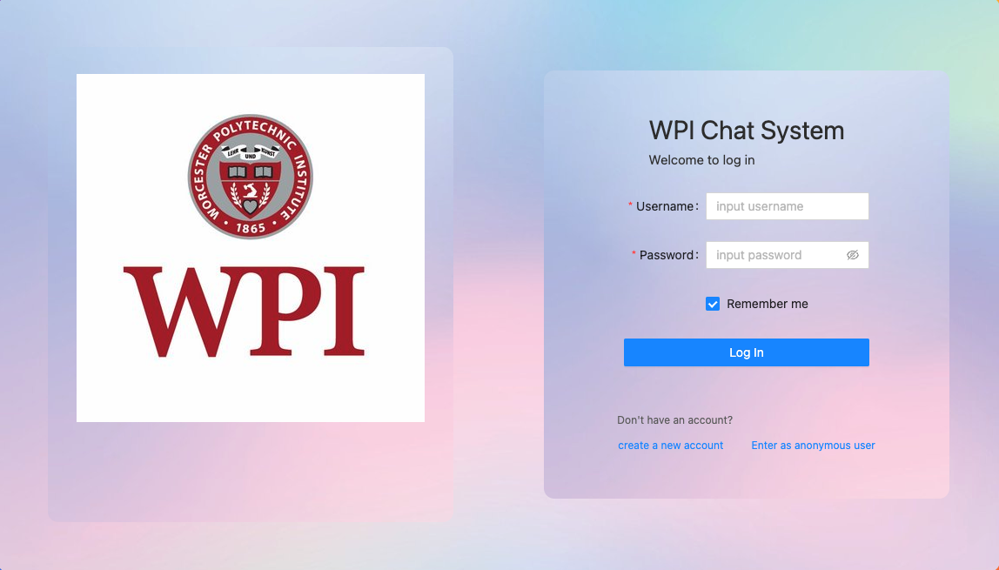
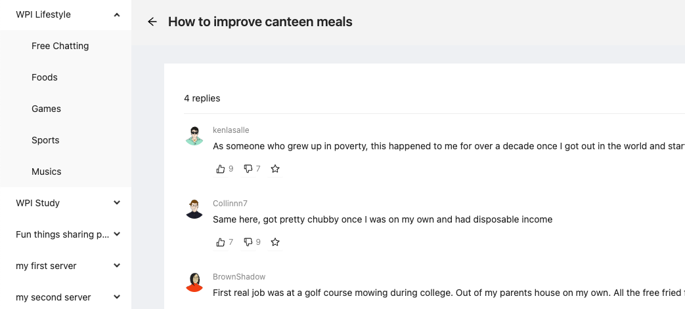
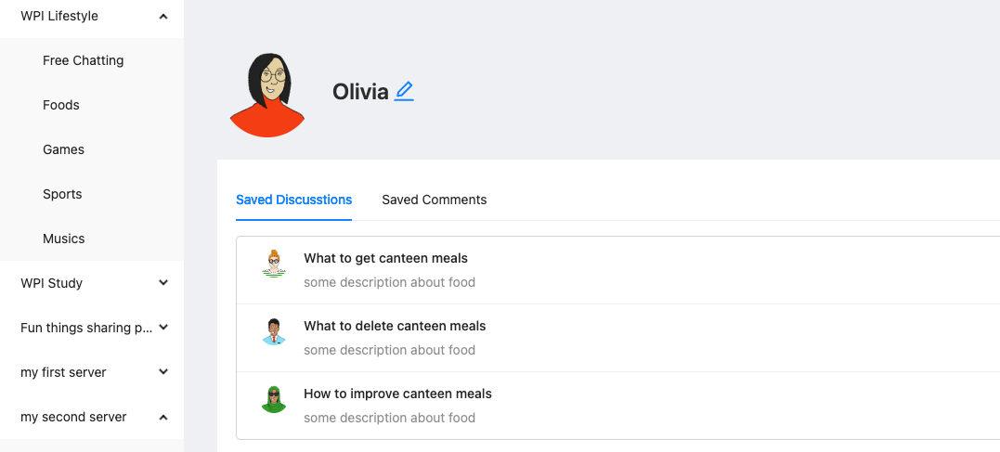
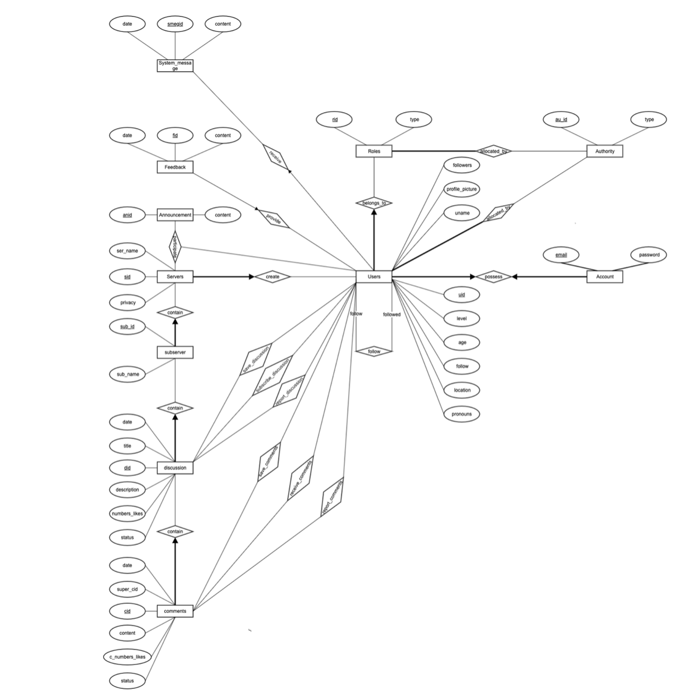

# Intramural-Forum-Website

- Here is a Forum-Website for WPI students and Professors
- you can create your own dashboard and topic, of course! including reply other's comments
- Some comments do not want to be seen by professor? No worry, you can create a secret discussion blocked professors!

# Using
```
git clone https://github.com/ScheWann/Intramural-Forum-Website.git
```
cd Intramural-Forum-Website
```
npm install
```
cd src
```
cd fakeServer
```
json-server --watch db.json
```

# DEMO


# Some screenshots
<h3>Login</h3>

<h3>Forum</h3>

<h3>Profile</h3>


# ER diagram and description


- Every user will be allocated to a role and get authorities
- Every user will get an account by register
- Users could follow and get followers
- Every user will get some system message from the administer
- Every user who has registered could give feedback to the system
- Every user could create and participate in Servers
- The user who creates the server could publish announcements and create subservers
- The user who creates the server could set the privacy to invisible to professors
- Every user who has registered could create their discussion under the subserver
- Every user who has registered could save, report, and subscribe to discussions
- Every user who has registered could save, report, and subscribe to comments
- Every user could receive every reply that under own replies

